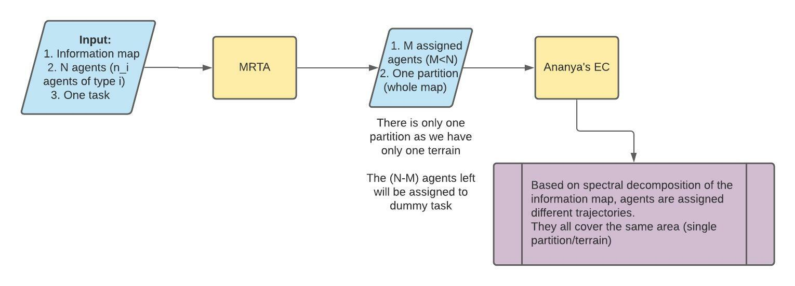
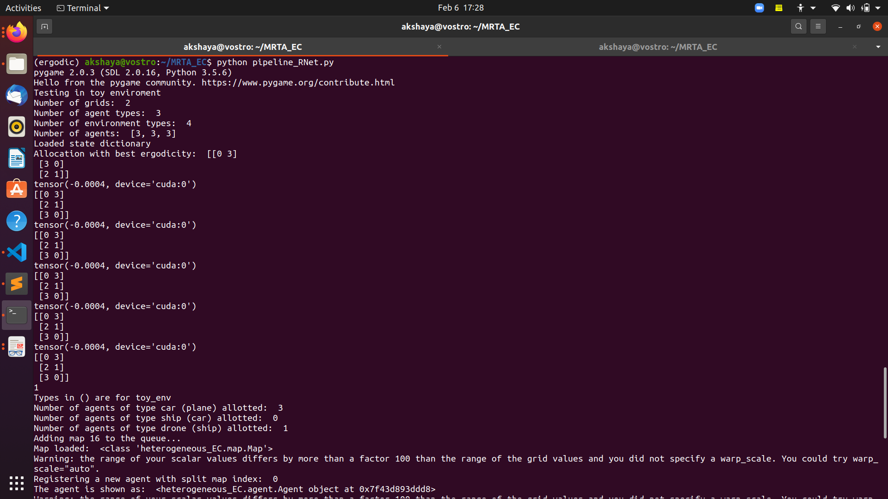

# MRTA_HeterogeneousEC
This repo containes the pipeline that combines the multi-agent task allocation with heterogeneous ergodic coverage.

## **Description**
The main file (pipeline_RNet.py) runs the MRTA algorithm to allocate 'N' agents of three types (plane, car and ship) to a single terrain (lake). This optimal allocation along with the sensor footprint for each type of agent is given as input to the heterogeneous ergodic coverage module to generate paths for each agent. The output is visualized in mayavi.

NOTE: Currently the number of each type of agent and terrain type is hardcoded in the pipeline. These can be customized as needed.

The basic flow of the pipeline is as shown in the figure below:


## **Folder structure**
```
Root
  |--heterogeneous_EC
  |--MRTA
  |--environment.yml
  |--requirements.txt
  |--pipeline_RNet.py
```

## **Setup Instructions**
Create an environment using the environment.yml file in the main folder. If using conda, it can be created using the following command:
```
conda env create -f environment.yml
```
Then, install the pip dependencies using the requirements.txt file:
```
pip install -r requirements.txt
```

## **Running the pipeline**
To run the pipeline, from the root directory execute:
```
python pipeline_RNet.py
```

## **Sample output**
NOTE: Close the mayavi scene pop ups that come when starting the heterogeneous EC module, they are called when registering an agent. 
A sample output for the task allocation and ergodic coverage are shown below with 3 agents each of type plane, car and ship with lake environemnt type. 



A demo video of the same can be found in: [demo video](https://drive.google.com/file/d/1ltiUGbJdsW-tPNewjME3aeiryTor1_2a/view?usp=sharing)

### **Things to complete**
- Change deployment cost from an intuitive number to a concrete function based on agent capabilities, fuel cost etc
- Possible inclusion of agent deterioration over time


